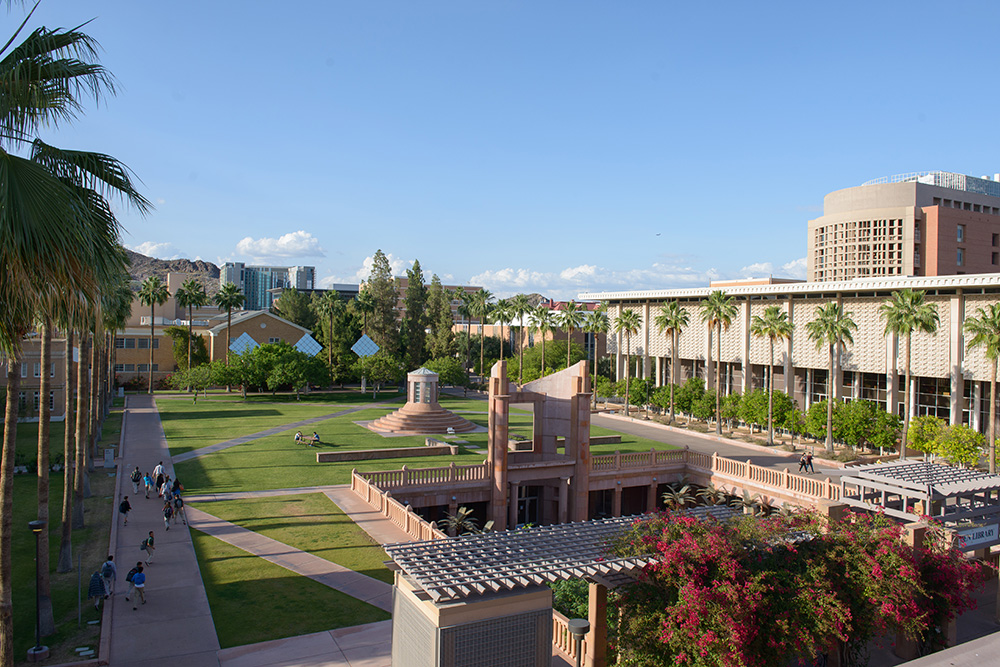
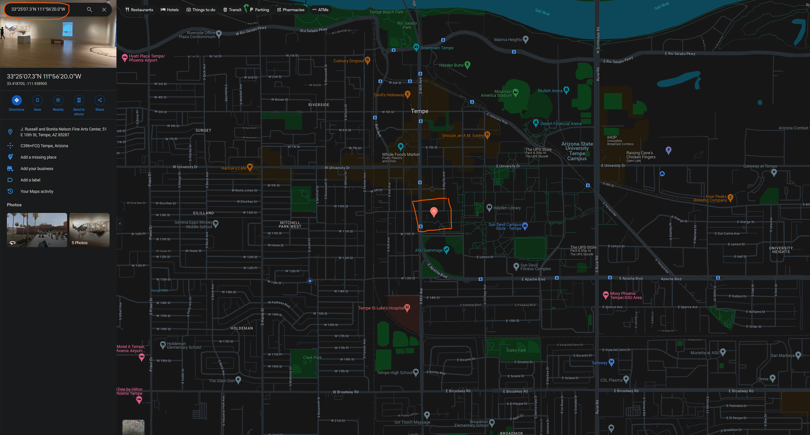
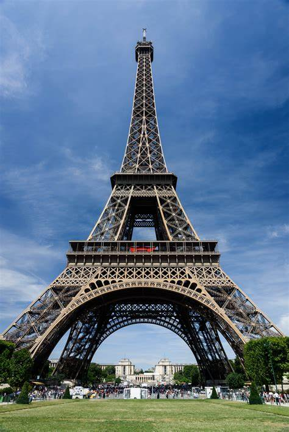
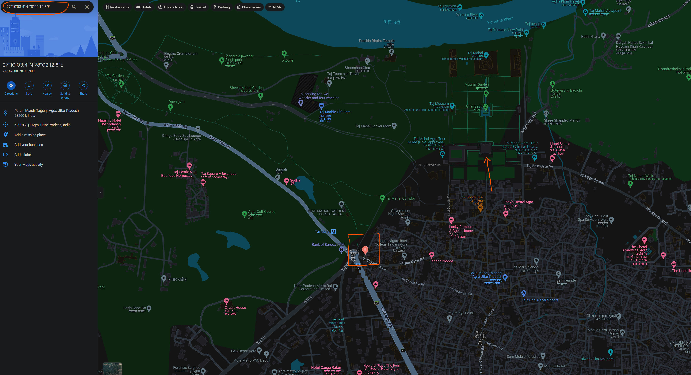

# GEOCLIP 

Paper Implementation with Pytorch Lightning Support for easy training and prediction scripts with multi-gpu support.

Paper Link: https://arxiv.org/pdf/2309.16020.pdf

## Description

Worldwide Geo-localization aims to pinpoint the precise location of images taken anywhere on Earth. This task has considerable challenges due to the immense variation in geographic landscapes. The image-to-image retrieval-based approaches fail to solve this problem on a global scale as it is not feasible to construct a large gallery of images covering the entire world. Instead, existing approaches divide the globe into discrete geographic cells, transforming the problem into a classification task. However, their performance is limited by the predefined classes and often results in inaccurate localizations when an image’s location significantly deviates from its class center. To overcome these limitations, we propose GeoCLIP, a novel CLIP-inspired Image-to-GPS retrieval approach that enforces alignment between the image and its corresponding GPS locations. GeoCLIP’s location encoder models the Earth as a continuous function by employing positional encoding through random Fourier features and constructing a hierarchical representation that captures information at varying resolutions to yield a semantically rich high-dimensional feature suitable to use even beyond geo-localization. To the best of our knowledge, this is the first work employing GPS encoding for geo-localization. We demonstrate the efficacy of our method via extensive experiments and ablations on benchmark datasets. We achieve competitive performance with just 20% of training data, highlighting its effectiveness even in limited-data settings. Furthermore, we qualitatively demonstrate geo-localization using a text query by leveraging the CLIP backbone of our image encoder. The project webpage is available at: https://vicentevivan.github.io/GeoCLIP

## Changelogs

### v1.0.0

- Organized the code in a structure with easy training and testing scripts.
- Added support for pytorch lightning and tensorboard logging.
- Added a config file to make experiments more scalable.

### v1.0.1

- Added evaluation script
- Performed evaluation on YFCC4K dataset.
    `Accuracy at 2500 km: 67.77`
    `Accuracy at 750 km: 44.44`
    `Accuracy at 200 km: 21.94`
    `Accuracy at 25 km: 9.08`
    `Accuracy at 1 km: 1.21`
- Added script to predict location for a given image.

### v1.0.2

- Added one more random test case for Washington University.

### v1.0.3

- Added Google Maps link for the test locations.

## Test Results

### Test 1 (ASU Library)

#### Fed Image

#### Results

- Image 1 GPS (top 3):
    ` tensor([[  33.4187, -111.9389], [  33.4187, -111.9369], [  33.4192, -111.9505]]) `
- Image 1 Probability:
    `tensor([0.0082, 0.0080, 0.0079])`

#### Location from Google Maps

<!--  -->

https://maps.app.goo.gl/T6XZhZX3VhwMFTxQA

<iframe src="https://www.google.com/maps/embed?pb=!1m17!1m12!1m3!1d3330.1742963924194!2d-111.94147492239159!3d33.41869997340215!2m3!1f0!2f0!3f0!3m2!1i1024!2i768!4f13.1!3m2!1m1!2zMzPCsDI1JzA3LjMiTiAxMTHCsDU2JzIwLjAiVw!5e0!3m2!1sen!2sus!4v1712521040223!5m2!1sen!2sus" width="1000" height=550" style="border:0;" allowfullscreen="" loading="lazy" referrerpolicy="no-referrer-when-downgrade"></iframe>

### Test 2 (Eiffel Tower)

#### Fed Image

#### Results

- Image GPS (top 3):
    `tensor([[48.8616,  2.2941], [48.8629,  2.2959], [48.8619,  2.2903]])`
- Image Probability:
    `tensor([0.0013, 0.0013, 0.0013])`

#### Location from Google Maps

https://maps.app.goo.gl/AwkWGAbRjemMiHCr8

<!--  -->
<iframe src="https://www.google.com/maps/embed?pb=!1m17!1m12!1m3!1d2624.822241255638!2d2.29152507797694!3d48.86159997133259!2m3!1f0!2f0!3f0!3m2!1i1024!2i768!4f13.1!3m2!1m1!2zNDjCsDUxJzQxLjgiTiAywrAxNyczOC44IkU!5e0!3m2!1sen!2sus!4v1712521138824!5m2!1sen!2sus" width="1000" height="550" style="border:0;" allowfullscreen="" loading="lazy" referrerpolicy="no-referrer-when-downgrade"></iframe>

### Test 3 (Taj Mahal)

#### Fed Image

#### Results

- Image GPS (top 3):
    `tensor([[27.1676, 78.0369], [27.1692, 78.0422], [27.1711, 78.0407]])`
- Image Probability:
    `tensor([0.0143, 0.0136, 0.0135])`

#### Location from Google Maps 

https://maps.app.goo.gl/SpTanRSWNxrXQNKQ6

<!--  -->
<iframe src="https://www.google.com/maps/embed?pb=!1m17!1m12!1m3!1d3549.6404732480546!2d78.03432507749352!3d27.167599976496216!2m3!1f0!2f0!3f0!3m2!1i1024!2i768!4f13.1!3m2!1m1!2zMjfCsDEwJzAzLjQiTiA3OMKwMDInMTIuOCJF!5e0!3m2!1sen!2sus!4v1712521321930!5m2!1sen!2sus" width="1000" height="550" style="border:0;" allowfullscreen="" loading="lazy" referrerpolicy="no-referrer-when-downgrade"></iframe>

### Test 4 (Taj Mahal)

#### Fed Image

#### Results

- Image GPS (top 3):
    `tensor([[ 35.8932, -78.8888], [ 35.8933, -78.8888], [ 35.9482, -79.0820]])`
- Image Probability:
    `tensor([0.0007, 0.0007, 0.0006])`

#### Location from Google Maps

<!--  -->

https://maps.app.goo.gl/VakQywnbXP4CndN1A

<iframe src="https://www.google.com/maps/embed?pb=!1m17!1m12!1m3!1d3232.1966153757867!2d-78.89137492234049!3d35.8931999725197!2m3!1f0!2f0!3f0!3m2!1i1024!2i768!4f13.1!3m2!1m1!2zMzXCsDUzJzM1LjUiTiA3OMKwNTMnMTkuNyJX!5e0!3m2!1sen!2sus!4v1712521447215!5m2!1sen!2sus" width="1000" height="550" style="border:0;" allowfullscreen="" loading="lazy" referrerpolicy="no-referrer-when-downgrade"></iframe>
