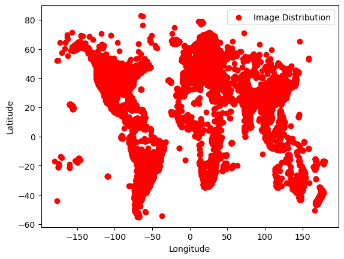
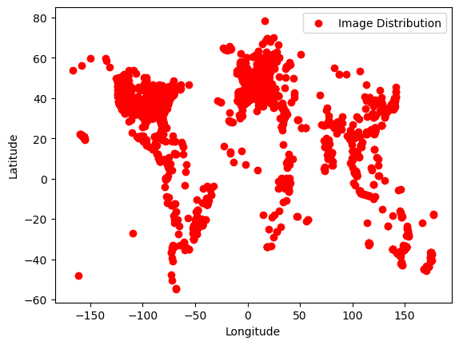
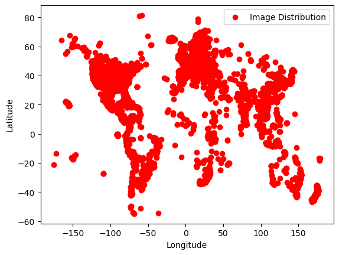

# GEOCLIP 

Paper Implementation with Pytorch Lightning Support for easy training and prediction scripts with multi-gpu support.

Paper Link: https://arxiv.org/pdf/2309.16020.pdf

## Description

Worldwide Geo-localization aims to pinpoint the precise location of images taken anywhere on Earth. This task has considerable challenges due to the immense variation in geographic landscapes. The image-to-image retrieval-based approaches fail to solve this problem on a global scale as it is not feasible to construct a large gallery of images covering the entire world. Instead, existing approaches divide the globe into discrete geographic cells, transforming the problem into a classification task. However, their performance is limited by the predefined classes and often results in inaccurate localizations when an image’s location significantly deviates from its class center. To overcome these limitations, we propose GeoCLIP, a novel CLIP-inspired Image-to-GPS retrieval approach that enforces alignment between the image and its corresponding GPS locations. GeoCLIP’s location encoder models the Earth as a continuous function by employing positional encoding through random Fourier features and constructing a hierarchical representation that captures information at varying resolutions to yield a semantically rich high-dimensional feature suitable to use even beyond geo-localization. To the best of our knowledge, this is the first work employing GPS encoding for geo-localization. We demonstrate the efficacy of our method via extensive experiments and ablations on benchmark datasets. We achieve competitive performance with just 20% of training data, highlighting its effectiveness even in limited-data settings. Furthermore, we qualitatively demonstrate geo-localization using a text query by leveraging the CLIP backbone of our image encoder. The project webpage is available at: https://vicentevivan.github.io/GeoCLIP

`Note: This particular model is trained on MP16 full dataset.`

## Model Architecture

```

GeoCLIP(
  (image_encoder): ImageEncoder(
    (clip_model): CLIPModel(
      (text_model): CLIPTextTransformer(
        (embeddings): CLIPTextEmbeddings(
          (token_embedding): Embedding(49408, 768)
          (position_embedding): Embedding(77, 768)
        )
        (encoder): CLIPEncoder(
          (layers): ModuleList(
            (0-11): 12 x CLIPEncoderLayer(
              (self_attn): CLIPAttention(
                (k_proj): Linear(in_features=768, out_features=768, bias=True)
                (v_proj): Linear(in_features=768, out_features=768, bias=True)
                (q_proj): Linear(in_features=768, out_features=768, bias=True)
                (out_proj): Linear(in_features=768, out_features=768, bias=True)
              )
              (layer_norm1): LayerNorm((768,), eps=1e-05, elementwise_affine=True)
              (mlp): CLIPMLP(
                (activation_fn): QuickGELUActivation()
                (fc1): Linear(in_features=768, out_features=3072, bias=True)
                (fc2): Linear(in_features=3072, out_features=768, bias=True)
              )
              (layer_norm2): LayerNorm((768,), eps=1e-05, elementwise_affine=True)
            )
          )
        )
        (final_layer_norm): LayerNorm((768,), eps=1e-05, elementwise_affine=True)
      )
      (vision_model): CLIPVisionTransformer(
        (embeddings): CLIPVisionEmbeddings(
          (patch_embedding): Conv2d(3, 1024, kernel_size=(14, 14), stride=(14, 14), bias=False)
          (position_embedding): Embedding(257, 1024)
        )
        (pre_layrnorm): LayerNorm((1024,), eps=1e-05, elementwise_affine=True)
        (encoder): CLIPEncoder(
          (layers): ModuleList(
            (0-23): 24 x CLIPEncoderLayer(
              (self_attn): CLIPAttention(
                (k_proj): Linear(in_features=1024, out_features=1024, bias=True)
                (v_proj): Linear(in_features=1024, out_features=1024, bias=True)
                (q_proj): Linear(in_features=1024, out_features=1024, bias=True)
                (out_proj): Linear(in_features=1024, out_features=1024, bias=True)
              )
              (layer_norm1): LayerNorm((1024,), eps=1e-05, elementwise_affine=True)
              (mlp): CLIPMLP(
                (activation_fn): QuickGELUActivation()
                (fc1): Linear(in_features=1024, out_features=4096, bias=True)
                (fc2): Linear(in_features=4096, out_features=1024, bias=True)
              )
              (layer_norm2): LayerNorm((1024,), eps=1e-05, elementwise_affine=True)
            )
          )
        )
        (post_layernorm): LayerNorm((1024,), eps=1e-05, elementwise_affine=True)
      )
      (visual_projection): Linear(in_features=1024, out_features=768, bias=False)
      (text_projection): Linear(in_features=768, out_features=768, bias=False)
    )
    (linear_layers): Sequential(
      (0): Linear(in_features=768, out_features=768, bias=True)
      (1): ReLU()
      (2): Linear(in_features=768, out_features=512, bias=True)
    )
  )
  (location_encoder): LocationEncoder(
    (LocationEncoderLayer0): LocationEncoderSingleFourierLayer(
      (fourier_encoding): GaussianEncoding()
      (linear1): Linear(in_features=512, out_features=1024, bias=True)
      (activ1): ReLU()
      (linear2): Linear(in_features=1024, out_features=1024, bias=True)
      (activ2): ReLU()
      (linear3): Linear(in_features=1024, out_features=1024, bias=True)
      (activ3): ReLU()
      (head): Sequential(
        (0): Linear(in_features=1024, out_features=512, bias=True)
      )
    )
    (LocationEncoderLayer1): LocationEncoderSingleFourierLayer(
      (fourier_encoding): GaussianEncoding()
      (linear1): Linear(in_features=512, out_features=1024, bias=True)
      (activ1): ReLU()
      (linear2): Linear(in_features=1024, out_features=1024, bias=True)
      (activ2): ReLU()
      (linear3): Linear(in_features=1024, out_features=1024, bias=True)
      (activ3): ReLU()
      (head): Sequential(
        (0): Linear(in_features=1024, out_features=512, bias=True)
      )
    )
    (LocationEncoderLayer2): LocationEncoderSingleFourierLayer(
      (fourier_encoding): GaussianEncoding()
      (linear1): Linear(in_features=512, out_features=1024, bias=True)
      (activ1): ReLU()
      (linear2): Linear(in_features=1024, out_features=1024, bias=True)
      (activ2): ReLU()
      (linear3): Linear(in_features=1024, out_features=1024, bias=True)
      (activ3): ReLU()
      (head): Sequential(
        (0): Linear(in_features=1024, out_features=512, bias=True)
      )
    )
  )
  (criterion): Contrastive_Loss()
)

```

-------------------------------------------------------------------------------------------------------------------------------------------------------

## Datasets

### MP16 Dataset

With 1,14,591 images, this is a subset of YFCC100M dataset often used for `training purposes`. First introduced in `Media Eval 2016 Task`.

Due to unavailability of the dataset in general on the internet I have curated the dataset and provided a Mediafire link for easy public access. The dataset.zip will contain the images and along with a .csv file providing the image name with location data. This .zip also contains the flikr image file links for the entire dataset.

[MediaFire Link](https://www.mediafire.com/file/871glcjyvrilasl/mp16.zip/file)
Download size ~2.65GB `(Contains subset of full MP16)`



### YFCC4K Dataset

With 4,536 images, this is a subset of YFCC100M dataset often used for `testing purposes`. Due to unavailability of the dataset in general on the internet I have curated the dataset and provided a Mediafire link for easy public access. The dataset.zip will contain the images and along with a .csv file providing the image name with location data.

[MediaFire Link](https://www.mediafire.com/file/jgrkn6v060fvilj/yfcc4k.zip/file)
Download size ~540MB



### YFCC26K Dataset

With 22,042 images, this is a subset of YFCC100M dataset often used for `training purposes`.

Due to unavailability of the dataset in general on the internet I have curated the dataset and provided a Mediafire link for easy public access. The dataset.zip will contain the images and along with a .csv file providing the image name with location data. The image sizes are restricted to 320px for the longest side and rest follows the aspect ratio of the original image. This .zip also contains the flikr image file links for the entire dataset.

[MediaFire Link](https://www.mediafire.com/file/oltncx6wfeg1jsh/yfcc25600.zip/file)
Download size ~505MB



-------------------------------------------------------------------------------------------------------------------------------------------------------

## Test Results

### Test 1 (ASU Library)

#### Fed Image


#### Results

- Image 1 GPS (top 3):
    ` tensor([[  33.4187, -111.9389], [  33.4187, -111.9369], [  33.4192, -111.9505]]) `
- Image 1 Probability:
    `tensor([0.0082, 0.0080, 0.0079])`

#### Location from Google Maps

https://maps.app.goo.gl/T6XZhZX3VhwMFTxQA

[](https://maps.app.goo.gl/T6XZhZX3VhwMFTxQA)

### Test 2 (Eiffel Tower)

#### Fed Image


#### Results

- Image GPS (top 3):
    `tensor([[48.8616,  2.2941], [48.8629,  2.2959], [48.8619,  2.2903]])`
- Image Probability:
    `tensor([0.0013, 0.0013, 0.0013])`

#### Location from Google Maps

https://maps.app.goo.gl/AwkWGAbRjemMiHCr8

[](https://maps.app.goo.gl/AwkWGAbRjemMiHCr8)

### Test 3 (Taj Mahal)

#### Fed Image


#### Results

- Image GPS (top 3):
    `tensor([[27.1676, 78.0369], [27.1692, 78.0422], [27.1711, 78.0407]])`
- Image Probability:
    `tensor([0.0143, 0.0136, 0.0135])`

#### Location from Google Maps 

https://maps.app.goo.gl/SpTanRSWNxrXQNKQ6

[](https://maps.app.goo.gl/SpTanRSWNxrXQNKQ6)

### Test 4 (Washington University)

#### Fed Image


#### Results

- Image GPS (top 3):
    `tensor([[ 35.8932, -78.8888], [ 35.8933, -78.8888], [ 35.9482, -79.0820]])`
- Image Probability:
    `tensor([0.0007, 0.0007, 0.0006])`

#### Location from Google Maps

https://maps.app.goo.gl/VakQywnbXP4CndN1A

[](https://maps.app.goo.gl/VakQywnbXP4CndN1A)

-------------------------------------------------------------------------------------------------------------------------------------------------------

## Changelogs

### v1.0.0

- Organized the code in a structure with easy training and testing scripts.
- Added support for pytorch lightning and tensorboard logging.
- Added a config file to make experiments more scalable.

### v1.0.1

- Added evaluation script
- Performed evaluation on YFCC4K dataset.
    `Accuracy at 2500 km: 67.77`
    `Accuracy at 750 km: 44.44`
    `Accuracy at 200 km: 21.94`
    `Accuracy at 25 km: 9.08`
    `Accuracy at 1 km: 1.21`
- Added script to predict location for a given image.

### v1.0.2

- Added one more random test case for Washington University.

### v1.0.3

- Added Google Maps link for the test locations.

### v1.0.4

- Added clickable images for google maps

### v1.0.5

- Added Model Architecture and Citations

### v1.0.6

- Code refactoring
- Curated dataset and attached links for the same (of Mediafire).
  - Mp16 [(link)](#mp16-dataset)
  - YFCC26k [(link)](#yfcc26k-dataset)
  - YFCC4k [(link)](#yfcc4k-dataset)

### v1.0.7

- Changed validation batch size to match with the GPS Queue size.

-------------------------------------------------------------------------------------------------------------------------------------------------------

## Acknowledgement

```
@inproceedings{geoclip,
  title={GeoCLIP: Clip-Inspired Alignment between Locations and Images for Effective Worldwide Geo-localization},
  author={Vivanco, Vicente and Nayak, Gaurav Kumar and Shah, Mubarak},
  booktitle={Advances in Neural Information Processing Systems},
  year={2023}
}
```
